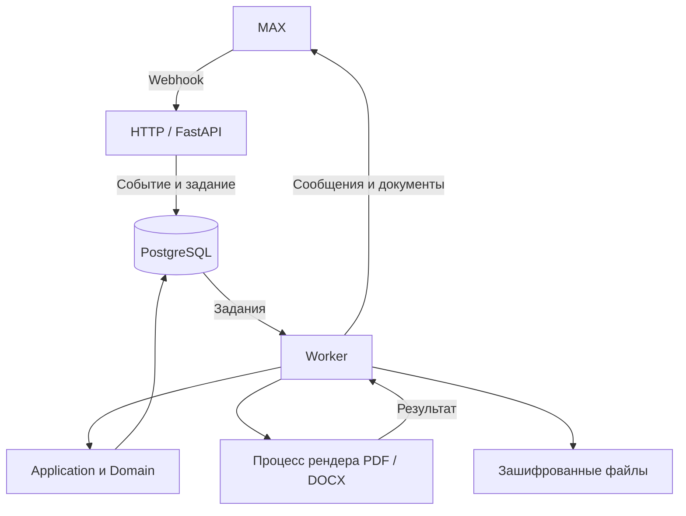

# Архитектура

Одна кодовая база Python запускается в двух ролях: HTTP-приложение и worker. PostgreSQL хранит кейсы, версии ввода, пакеты данных и очереди inbox/jobs/outbox. Worker готовит документы в отдельном процессе и отправляет сообщения через MAX.

## Модули

| Модуль | Назначение |
| --- | --- |
| `contracts` | DTO, версии, ошибки, контрольные суммы |
| `domain/cases`, `domain/conversation` | Состояние кейса, подтверждение ввода, навигация |
| `domain/catalog`, `domain/matching` | Точные комплектации, сравнение параметров, ранжирование |
| `domain/pricing` | Расчёт в целых копейках, отдельный учёт сертификата и доставки |
| `domain/routes`, `domain/documents` | Условия маршрута и содержание документов |
| `application` | Согласование операций, транзакций и пользовательского диалога |
| `adapters` | PostgreSQL, MAX, шифрование, хранение и рендер |
| `worker` | Обработка очередей, повторы, восстановление задач |
| `operations` | Пакеты данных, очистка, резервное копирование и восстановление |

Domain получает типизированные данные и возвращает результаты без сетевых запросов. Application управляет транзакциями. Адаптеры выполняют операции с внешними системами.

## Обработка события

1. HTTP проверяет секрет и формат обновления MAX, затем записывает inbox и job одной транзакцией.
2. Worker получает задание с ограниченным сроком владения и вызывает application.
3. Подтверждённые ответы формируют предварительный результат. Подтверждение пользователя фиксирует неизменяемый manifest.
4. Отдельный процесс создаёт PDF/DOCX по manifest. Worker шифрует файлы и публикует ссылки на готовые материалы.
5. Outbox управляет отправкой. Повтор обновления не создаёт повторное действие. Неопределённый исход отправки требует явного действия пользователя.

При локальном подключении `tools/poll_max.py` получает обновления polling-запросами и передаёт их в тот же защищённый HTTP-вход.

## Данные и доступ

Пакеты в `data/releases` фиксируют версии и SHA-256 каталога, профилей, маршрута, источников, шаблонов и шрифтов. Активный пакет задаётся отдельно для области бота и режима.

Чувствительные записи и документы шифруются AES-GCM. Кнопки и материалы связаны с владельцем, версией кейса и сроком действия. Удаление кейса немедленно закрывает доступ, а worker выполняет физическую очистку. Renderer получает только данные документа.

Конфигурация, сроки хранения и операции восстановления описаны в [RUNBOOK.md](RUNBOOK.md). Контракты HTTP находятся в [OpenAPI](api/openapi.json) и [DATA-API.yaml](api/DATA-API.yaml).
